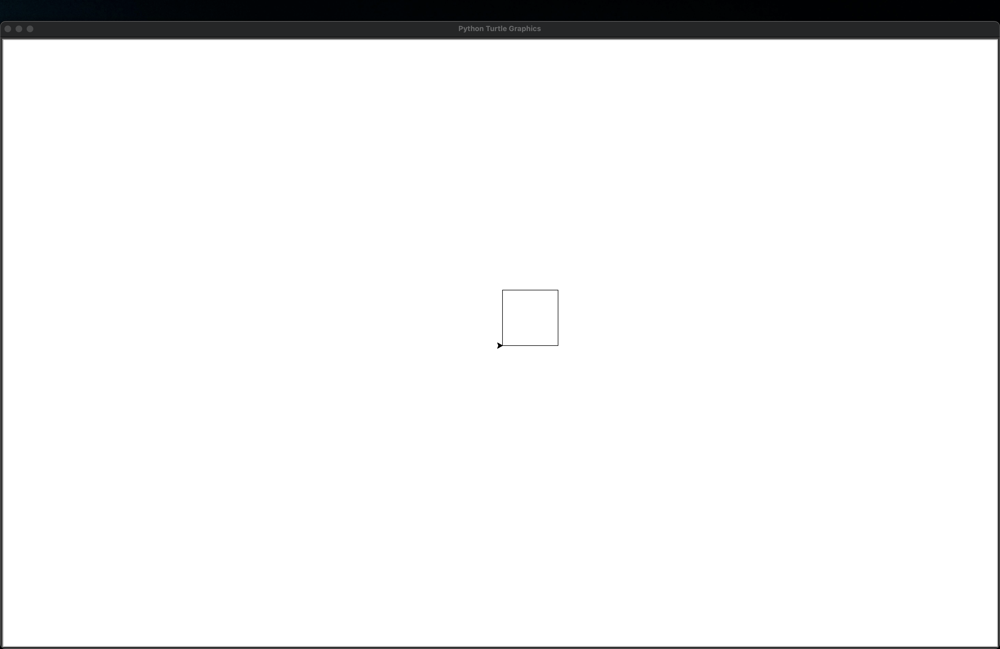
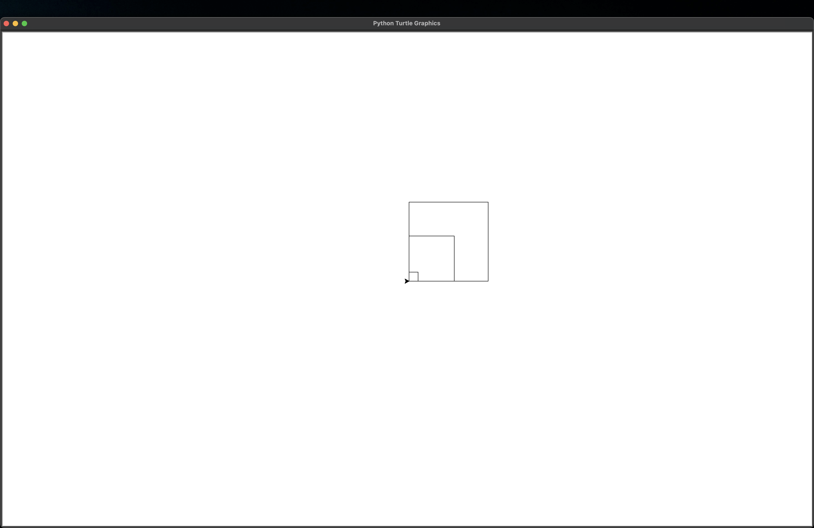
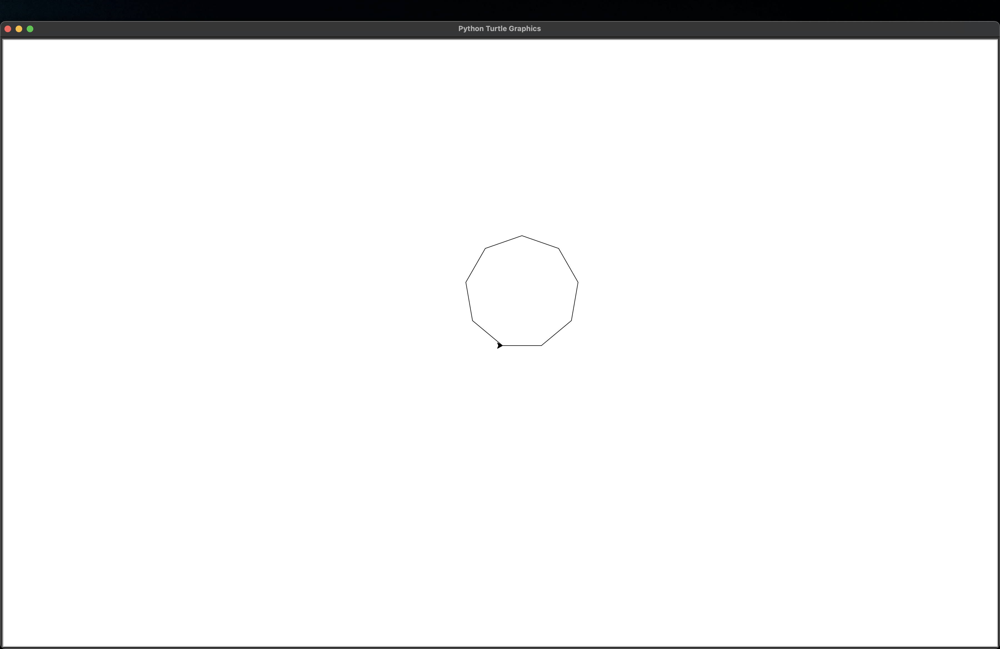
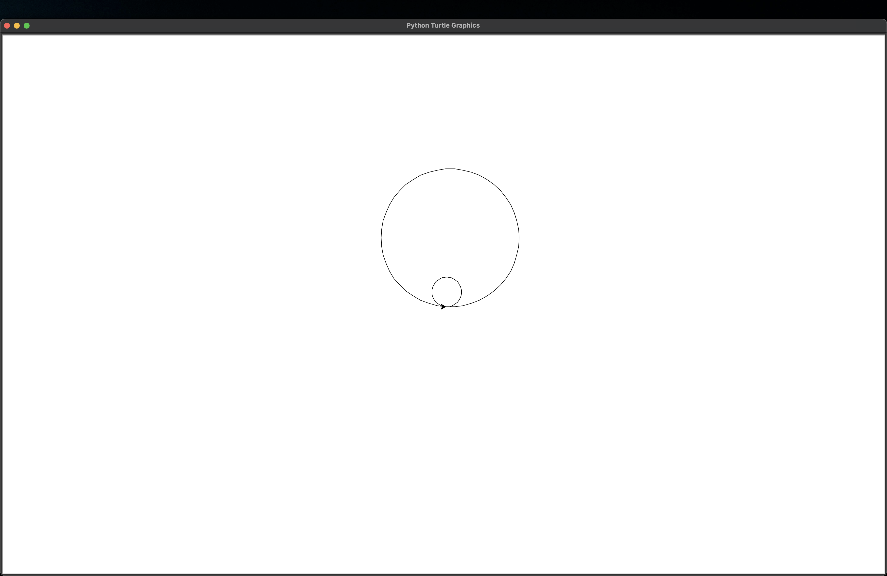
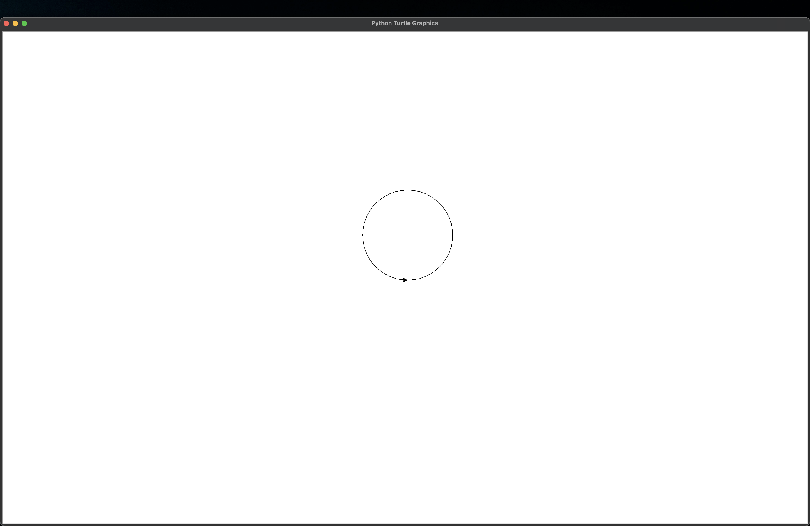

# Week 2 Lab Report
Boray Tuna Goren

# Exercise 1
## Screenshot

## Reflection
I think the reason behind the first exercise was getting used to using for loops. Because using the for loop decreased the number of needed lines from 8 to 3. It repeates the required 2 lines 4 times. Also, the important part was using a single argument in the function.

# Exercise 2
## Screenshot

## Reflection
The big difference in the second exercise over first exercise was using a second argument. This second argument allowed us to determine the size of the square when we called the function. So, it was not predetermined.

# Exercise 3
## Screenshot

## Reflection
Another big difference was introducing a new argument. Now, we can tell to the function how many sides we want, as well as the length of those sides. I used a local var called angle to determine how much each side should rotate in order to keep the internal angle at 360. In this exercise, I learned to use number of sides to find the angle for sides.

# Exercise 4
## Screenshot

## Reflection
This time the big difference is the function draws a circle instead of square using the same function from the exercise 3. But for it to work I introduced a new local var for number of sides. In this exercise I learned to use radius and circumference as a tool to find the length of a side.

# Exercise 5
## Screenshot

## Reflection
In this exercise, first I wrote the function to create a more general square with 4 arguments. Then, call that function in side of the new arc function I wrote. In the arc function, I learned to use radius and angle of the circle to calculate the number of sides, length of sides, and rotation angle of sides.